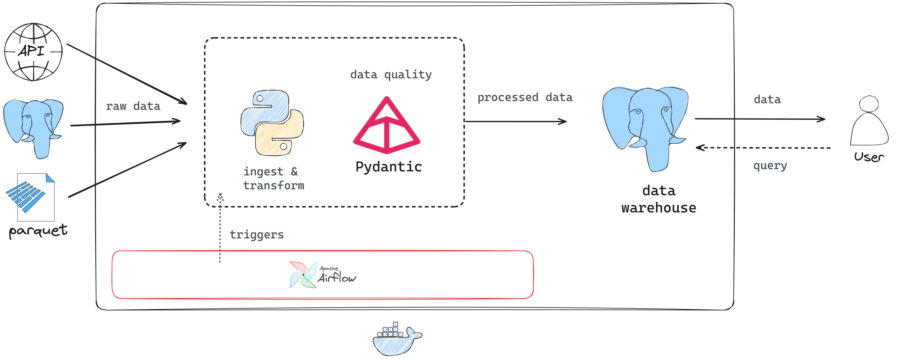

# [BIX Tecnologia] Desafio Técnico - Vaga Engenheira(o) de Dados - Junior
### Candidato: Victor Buendia Cruz de Alvim

Este repositório tem a solução ao desafio técnico proposto para a vaga de Engenheiro de Dados Júnior.

## Visão Geral



O projeto possui a arquitetura ilustrada acima, na qual dados de três fontes distintas (um banco PostGres, uma API e um arquivo Parquet) são ingeridos e transformados dentro da aplicação usando Python.

Depois, utilizando a biblioteca Pydantic, faz-se uma validação dos tipos de dado de cada modelo ingerido e, a partir dessa validação, os dados são inseridos no Data Warehouse (que é um banco PostGres).

O pipeline está orquestrado com o Airflow, que executa a rotina de ingestão diariamente às 00:00 no horário UTC.

Toda a aplicação está containerizada utilizando Docker para uma execução correta em qualquer máquina.

# Como executar o projeto

## Variáveis de ambiente

É preciso criar um arquivo `.env` com as variáveis de ambiente antes de iniciar o projeto.

```.env
BIX_DB_HOST=
BIX_DB_PORT=5432
BIX_DB_USER=
BIX_DB_PASS=
BIX_DB_NAME=postgres

BIX_ENDPOINT_FUNCIONARIOS=
BIX_ENDPOINT_CATEGORIAS=

DOCKER_DB_HOST=banco
DOCKER_DB_PORT=5432
```

Se estiver usando Linux, é importante rodar o seguinte comando para que o Airflow tenha permissão sobre os arquivos:

```bash
echo -e "AIRFLOW_UID=$(id -u)\nAIRFLOW_GID=0" > .env
```

Basta um comando para subir todos os serviços:
	
```bash
make deploy
```

> *Observação:* É preciso ter instalado o Docker, Docker Compose (>=1.2.9) e Make na sua máquina.

Duas categorias de serviço subirão após o comando ser executado:

1. banco
2. airflow
   1. postgres
   2. redis
   3. airflow-web-server
   4. airflow-scheduler
   5. airflow-worker
   6. airflow-triggerer
   7. airflow-init
   8. airflow-cli
   9. flower
   
O serviço de `banco` possui o banco de dados PostGres para a ingestão dos dados, enquanto os serviços do `airflow` são relativos a seu funcionamento.

# Estrutura do código

Um resumo de como está organizada a estrutura de pasta pode ser vista abaixo:

```bash
.
├── Dockerfile
├── LICENSE
├── Makefile
├── README.md
├── config
│   └── airflow.cfg
├── dags
│   ├── daily_ingestion.py
│   └── dummy_dag.py
├── docker-compose.yaml
├── logs
├── plugins
├── postgres-db-volume
├── postgres_data
├── requirements.txt
├── scripts
│   ├── api.py
│   ├── connector.py
│   ├── environment.py
│   ├── helper.py
│   ├── inserter.py
│   ├── models
│   │   ├── categoria.py
│   │   ├── funcionario.py
│   │   └── venda.py
│   └── pipeline.py
└── .env  
```

# Observações

- Utilização de ORM, Data Mesh
- Containerização usando Docker
- 